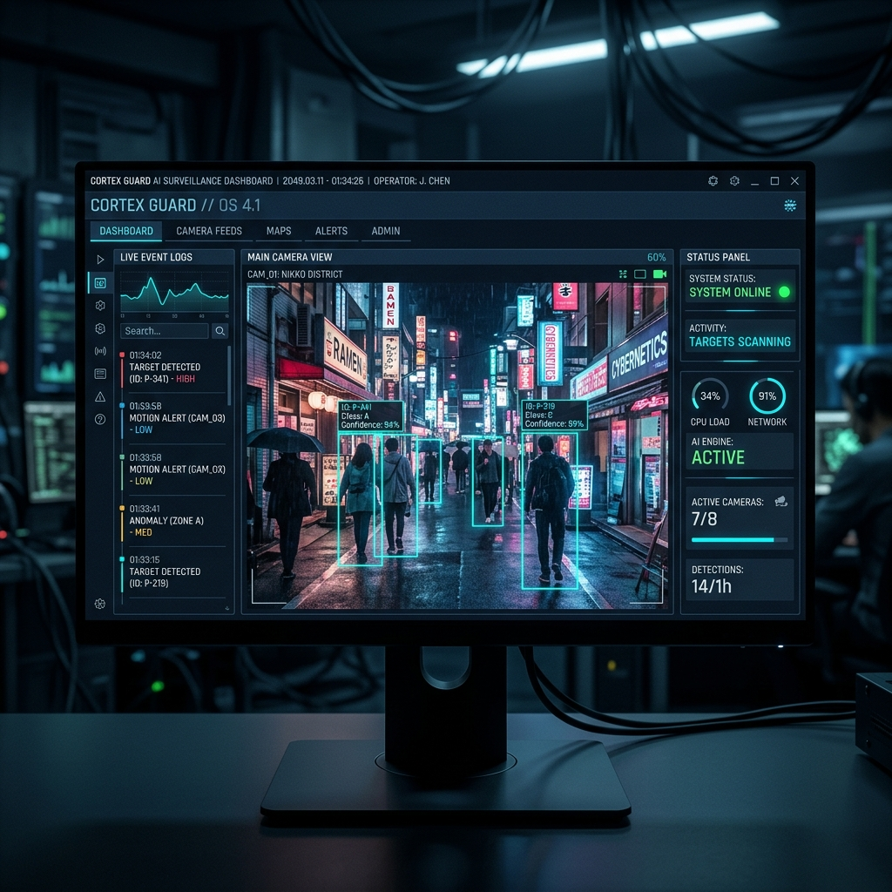
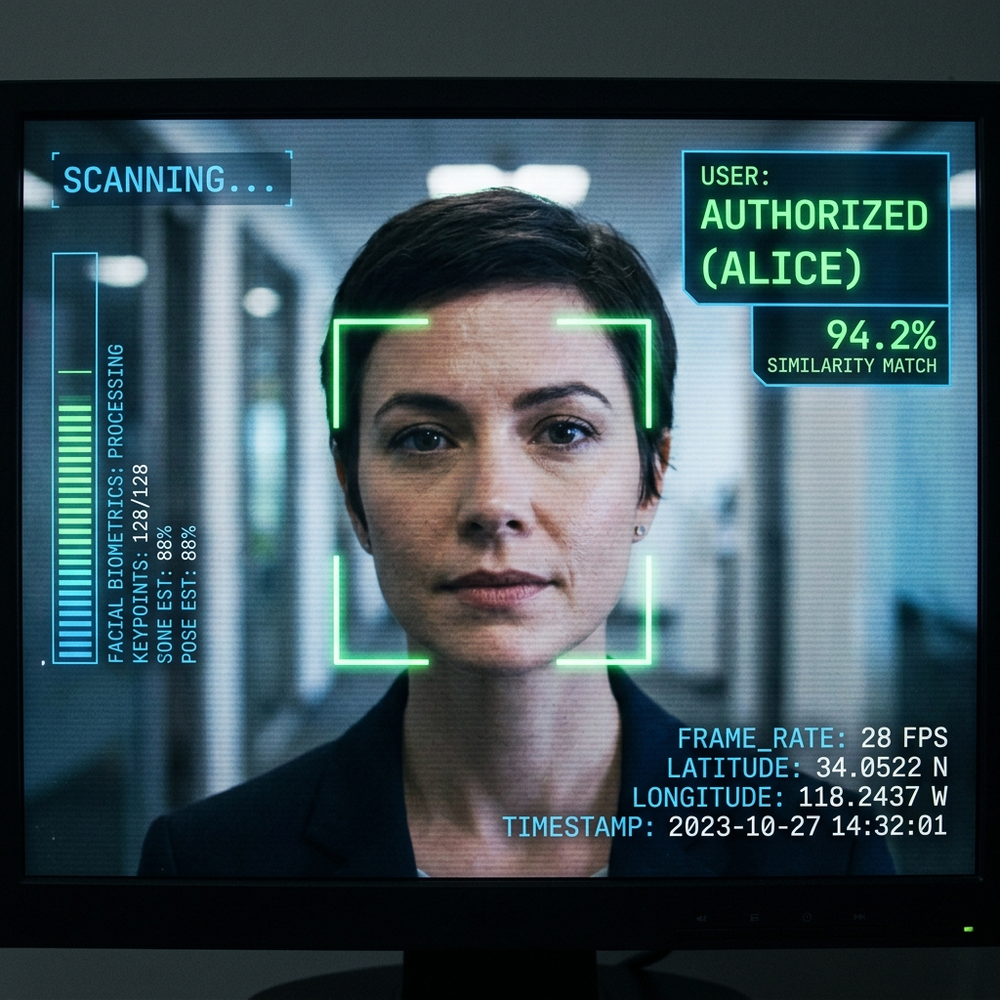

# 🛰️ OMS — OBJECT MONITORING SYSTEM

### ⚡ AI-Powered Smart Surveillance & Real-Time Monitoring Platform

<div align="center">

[](https://www.python.org/)
[](https://opencv.org/)
[](https://github.com/ultralytics/ultralytics)
[](https://www.riverbankcomputing.com/software/pyqt/)
[](https://github.com/Prajan77v/OSM)
[](https://choosealicense.com/licenses/mit/)

</div>

---

```
========================================================================
[OMS SYSTEM TERMINAL BOOTUP]
>> INITIALIZING AI ENGINE... OK
>> LINKING CAMERA FEED PORTS... OK
>> LOADING OBJECT DETECTION DATASET... YOLOv8 ACTIVE
>> SECURITY PROTOCOLS... OPERATIONAL
========================================================================
```

**OMS (Object Monitoring System)** is a next-generation, AI-driven surveillance and real-time monitoring console. By integrating advanced deep learning models and high-frequency computer vision pipelines directly with live camera feeds, OMS elevates standard, passive CCTV hardware into an active, intelligent monitoring dashboard.

Whether analyzing RTSP streams, IP cameras, or standard USB webcams, OMS detects subjects, tracks spatial movement, identifies known personnel, logs security events, and presents a responsive HUD-style PyQt6 desktop controller interface.

---

## 👁️ SYSTEM PREVIEW // OVERVIEW

In traditional security environments, human operators are forced to sit through hours of stagnant footage, suffering from cognitive fatigue and missing key security indicators. 

**OMS bridges this gap** by injecting automation and machine intelligence straight into the loop. It continuously watches the scene, identifies target classes, registers known/unknown face profiles, maps movement trajectories, and maintains a structured, queryable event log.

---

## ⚠️ THE SURVEILLANCE GAP // PROBLEM STATEMENT

Standard video surveillance setups suffer from critical vulnerabilities that place property and security at risk:

* **The Fatigue Bottleneck:** Guards monitoring multiple feeds miss up to 95% of security incidents after just 20 minutes of continuous viewing.
* **Passive Post-Event Review:** Traditional systems serve only as digital tape recorders, helping you review *how* a break-in occurred, but doing nothing to *prevent* it in real time.
* **Stream Overload:** Managing, viewing, and making sense of dozens of cameras simultaneously is beyond human capacity.
* **Absence of Scene Context:** Traditional CCTV cameras cannot differentiate between a blowing branch, a stray dog, or a trespasser moving through a restricted zone.

**OMS turns surveillance from a passive archive tool into a proactive, intelligent agent.**

---

## ⚙️ SYSTEM PIPELINE // HOW OMS WORKS

The life of a video frame inside the OMS engine moves through the following stages:

```
[ Camera Feed ] ──────────► Ingests Raw Streams (Webcam, CCTV, RTSP)
       │
       ▼
[ Frame Capture ] ────────► Decodes and Buffers Video Packets (OpenCV)
       │
       ▼
[ Preprocessing ] ────────► Normalizes Frame Layout, Scales, and Color Space
       │
       ▼
[ Object Detection ] ─────► YOLO Inference Maps Boundaries and Classes
       │
       ▼
[ Face Rec / Track ] ─────► Extracts Embedding Vector & Associates Tracking ID
       │
       ▼
[ Event Logging ] ────────► Commits Alert Metadata to Disk Database
       │
       ▼
[ Live UI Dashboard ] ────► Updates PyQt6 Screen Buffer and Active Log Grid
```

### Process Step Details
1. **Ingestion & Capture:** The system uses a multi-threaded OpenCV buffer stream to decode input sources (USB cameras, RTSP streams, or local files) asynchronously, preventing frame-drop and latency lag.
2. **Frame Preprocessing:** Video frames are resized and converted to standard input matrices matching the YOLO neural network layers.
3. **Object Detection:** The YOLO (You Only Look Once) engine executes forward inference to locate boundary coordinates and confidence scores for targets (e.g., people, backpacks, objects).
4. **Face Identification & Tracking:**
   * **Face Match:** Detected facial crops are translated into 128-dimensional embedding vectors using deep networks and compared against registered templates.
   * **Centroid Tracking:** Calculates Euclidean distance shifts of target centroids across sequential frames to assign persistent IDs and trace trajectories.
5. **Log Persistence:** Significant event transitions are logged asynchronously to local CSV/SQLite registries, recording timestamps, IDs, and classifications.
6. **Dashboard Output:** Bounding boxes, logs, and metadata parameters are overlaid onto the PyQt6 display buffer for the operator terminal.

---

## 🚀 CORE CAPABILITIES // KEY FEATURES

* **Multi-Source compatibility:** Supports direct integration with USB Webcams, Local Video Directories, and RTSP / IP CCTV streams.
* **Real-time Detection:** High-speed, hardware-accelerated YOLO classification model.
* **Face Verification:** Integrated facial embedding database to identify registered personnel vs unknown visitors.
* **Continuous Trajectory Tracking:** Track coordinate histories across frames to avoid double-logging active subjects.
* **Automated Log Registers:** Logs timestamps, tracking IDs, labels, and match confidence parameters directly.
* **PyQt6 HUD Console:** Elegant, responsive control dashboard with switches to toggle frame overlays (boundaries, trails, face marks).

---

## 🏗️ SYSTEM ARCHITECTURE // SCHEMATIC

OMS uses a clean, decoupled layer architecture:

1. **Input Interface Layer:** Decodes video sources into raw numpy frame matrices.
2. **Preprocessing Layer:** Sanitizes and scales frames to match neural input shapes.
3. **Core Deep Learning Layer:** Executes parallel inference threads for YOLO detection and facial embeddings.
4. **Context Tracking Layer:** Evaluates centroid shifts to persist target tracking IDs.
5. **Database Registry Layer:** Asynchronously logs alert updates to files.
6. **Presentation HUD Layer:** A PyQt6-based dashboard rendering the visual bounding box overlays and logs.

---

## 🧩 MODULE BREAKDOWN // FUNCTIONAL SCHEMATIC

```
 OMS PLATFORM
 ├── Camera Input Module    ── Ingests feeds, scales resolution, drops dead frames.
 ├── Detection Module       ── Runs YOLO model, extracts boundary boxes & conf.
 ├── Face Rec Module        ── Isolates faces, runs embedding comparisons.
 ├── Tracking Module        ── Persists IDs across frame coordinates over time.
 ├── Event Logger Module    ── Asynchronously commits event tables to disk.
 └── PyQt6 Dashboard UI     ── Manages screen layouts, overlay switches, lists.
```

---

## 💻 TECH STACK // POWERING THE SYSTEM

| Technology | Purpose / Application |
| :--- | :--- |
| **Python** | System core, processing logic, and library gluing |
| **OpenCV** | Direct video ingestion, RTSP decoding, and drawing overlays |
| **YOLO Engine** | Deep learning model architecture for object detection |
| **PyQt6** | Desktop GUI layout, hardware rendering, and state buttons |
| **NumPy** | High-performance matrix operations on video frame buffers |
| **Face Recognition** | Facial crop embedding generation and similarity math |

---

## 📁 SYSTEM LAYOUT // PROJECT STRUCTURE

Below is the repository directory tree for the Object Monitoring System:

```
oms/
├── app/
│   ├── __init__.py
│   └── main.py                     # App bootstrap and main thread loop
├── core/
│   ├── __init__.py
│   ├── camera.py                   # Camera stream thread pool manager
│   ├── engine.py                   # Master processing loop orchestrator
│   └── logger.py                   # Event writer thread (CSV/SQLite)
├── detection/
│   ├── __init__.py
│   ├── yolo_detector.py            # YOLO model interface and boundaries extractor
│   └── classes.txt                 # Target label classes configuration
├── recognition/
│   ├── __init__.py
│   ├── face_rec.py                 # Embedding generator and database matcher
│   └── database/                   # Storage of registered personnel faces
├── tracking/
│   ├── __init__.py
│   └── tracker.py                  # Centroid-based tracking algorithm
├── ui/
│   ├── __init__.py
│   ├── dashboard.py                # PyQt6 window layouts and controllers
│   ├── resources/                  # UI icons, stylesheets, and assets
│   └── stylesheet.qss              # Custom cyberpunk dark-mode styles
├── models/
│   ├── yolov8n.pt                  # YOLO model weight assets (auto-downloaded)
│   └── facenet.onnx                # Face embedding model file
├── logs/
│   └── event_logs.csv              # Output log files for surveillance telemetry
├── requirements.txt                # System dependency configuration
└── README.md                       # Documentation index
```

---

## ⚙️ INITIALIZATION // INSTALLATION

### 1. Clone the Registry
```bash
git clone https://github.com/Prajan77v/OSM.git
cd osm
```

### 2. Configure Virtual Environment
```bash
# Create environment
python -m venv venv

# Activate on Windows
venv\Scripts\activate

# Activate on macOS / Linux
source venv/bin/activate
```

### 3. Load Dependencies
```bash
pip install -r requirements.txt
```

### 4. Fetch AI Models
Download the YOLO weights and FaceNet model files, placing them inside the `models/` directory:
```bash
# Example command or setup script
python core/download_models.py
```

---

## 📊 OPERATION GUIDE // USAGE

Launch the monitoring console:
```bash
python app/main.py
```

### Operational Steps:
1. **Choose Feed Source:** Select `Webcam`, `IP Camera (RTSP URL)`, or a `Local Video file` from the UI source dropdown.
2. **Start Scanner:** Click **INITIALIZE SYSTEM**. The live camera feed will load with bounding box overlays.
3. **Face Registration:** Navigate to the database config menu to register names and photos for face recognition.
4. **Read Logs:** The operational log grid on the right updates instantly as new subjects enter or leave the camera scene.
5. **System Export:** Event histories can be exported to CSV files inside the `logs/` directory for analytical reports.

---

## 📸 COMMAND CONTROL // SHOWCASE & DEMOS

<div align="center">

### OMS Dashboard UI Console
*Desktop dashboard built with PyQt6 displaying video stream overlays, active track cards, and live log tables.*


<br>

### Real-Time Detections Gallery
*YOLOv8 boundaries identifying person classifications, bags, and tools simultaneously.*



</div>

---

## 🔮 UPCOMING TRANSMISSIONS // FUTURE ROADMAP

* **Behavior Anomaly Flags:** Automatically trigger warning overlays for loitering, falls, or physical violence.
* **Instant Security Alerts:** Connect Telegram bot integrations to forward snapshots of intruders directly to mobile devices.
* **Multi-Stream Node Layout:** Scale the GUI layout to monitor 4 distinct camera RTSP streams simultaneously.
* **Cloud Logs Syncer:** Export SQLite surveillance database records directly to remote Web panels.
* **Hardware Acceleration:** Complete integration of TensorRT/ONNX Runtime for faster edge device processing.

---

## 📡 SYSTEM VIVA FAQ // Troubleshooting

#### Q1: What is OMS, and why is it useful?
* **A:** OMS is an AI-powered surveillance program. It overlays intelligent computer vision on top of normal webcam or IP camera streams to automate security logging, reducing manual monitoring fatigue.

#### Q2: Why did you choose YOLO for object detection?
* **A:** YOLO (You Only Look Once) provides the optimal speed-to-accuracy balance for real-time video processing (20+ FPS) on standard edge devices.

#### Q3: How is tracking different from detection?
* **A:** Detection identifies objects in a single frame. Tracking traces target trajectories across sequential frames and assigns unique IDs (e.g. `Person #05`) to prevent duplicate logs.

#### Q4: How is face recognition processed?
* **A:** Facial zones are localized, cropped, and passed to a deep network (such as FaceNet) to generate 128-D vector embeddings, which are compared against stored databases.

---

## 📡 SYSTEM TERMINAL // CONCLUSION

OMS demonstrates how lightweight modern deep learning models can be bundled into standard computer hardware to build active, intelligent home or facility security applications. 

Explore the source code, play around with the modules, and help us improve the monitoring engine!

* **Maintained by:** Prajan77v
* **Project Status:** Active/Operational
* **Contributions:** PRs are welcome. Please read contribution guidelines before submitting edits.
* **License:** This project is licensed under the MIT License.
