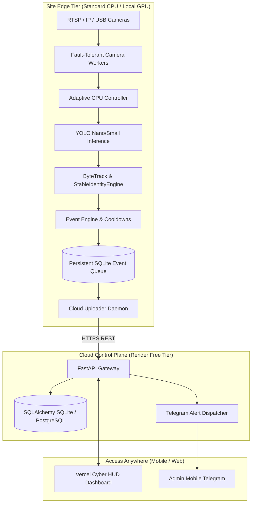

# OMS Sentinel — Autonomous AI Surveillance Platform
### CPU-First Edge Intelligence + Zero-GPU Free Cloud Control Plane

[](LICENSE)
[](https://www.python.org/)
[](https://fastapi.tiangolo.com)
[](https://nextjs.org/)
[](https://render.com)
[](https://vercel.com)

---

## 🏛️ System Architecture


```mermaid
flowchart TD
    subgraph Edge["Site Edge Tier (Standard CPU / Local GPU)"]
        Cam[RTSP / IP / USB Cameras] --> Worker[Fault-Tolerant Camera Workers]
        Worker --> Adaptive[Adaptive CPU Controller]
        Adaptive --> Detector[YOLO Nano/Small Inference]
        Detector --> Tracker[ByteTrack & StableIdentityEngine]
        Tracker --> Events[Event Engine & Cooldowns]
        Events --> Queue[(Persistent SQLite Event Queue)]
        Queue --> Sync[Cloud Uploader Daemon]
    end

    subgraph Cloud["Cloud Control Plane (Render Free Tier)"]
        Sync -->|HTTPS REST| API[FastAPI Gateway]
        API --> DB[(SQLAlchemy SQLite / PostgreSQL)]
        API --> TG[Telegram Alert Dispatcher]
    end

    subgraph Client["Access Anywhere (Mobile / Web)"]
        API <--> Vercel[Vercel Cyber HUD Dashboard]
        TG --> Admin[Admin Mobile Telegram]
    end
```

---

## ✨ Key Highlights

- ⚡ **Zero Cloud GPU Required**: 100% of computer vision and neural network inference executes on local edge hardware (standard multi-core CPUs or local NVIDIA GPUs).
- 🌐 **Free Cloud Control Plane**: Hosts API on Render Free tier (512MB RAM / 0.1 vCPU) and visual command dashboard on Vercel.
- 🛡️ **Offline Autonomy**: Local persistent SQLite event queue guarantees zero event loss during internet disruptions or server cold-starts.
- 📉 **Adaptive CPU Throttling**: Automatically scales detection resolutions and frame skips based on real-time CPU telemetry.
- 🔕 **Alert Fatigue Prevention**: Event deduplication hashes and smart cooldowns prevent notification spam.

---

## 🚀 Quick Start Guide

### 1. Edge Agent (On-Premises Surveillance PC)
```bash
# 1. Clone repo
git clone https://github.com/Prajan77v/OSM.git
cd OSM

# 2. Setup Virtual Environment
python -m venv venv
venv\Scripts\activate      # On Windows
source venv/bin/activate   # On Linux/macOS

# 3. Install Edge dependencies
pip install -r requirements-edge.txt

# 4. Start Edge Agent
python edge/agent.py
```

### 2. Cloud Hub (Render Free Deployment)
- **Runtime**: Python 3
- **Build Command**: `pip install -r requirements-cloud.txt`
- **Start Command**: `uvicorn cloud_api:app --host 0.0.0.0 --port $PORT`
- **Environment Variables**:
  - `TELEGRAM_BOT_TOKEN`: Your Telegram Bot Token
  - `TELEGRAM_CHAT_ID`: Your Telegram Chat ID
  - `OMS_EDGE_TOKEN`: Shared secret token for authorized edge nodes

### 3. Frontend Dashboard (Vercel)
- **Framework**: `Next.js`
- **Root Directory**: `frontend`
- **Environment Variable**: `NEXT_PUBLIC_OMS_API_URL` = `https://oms-sentinel-cloud.onrender.com`

---

## 📂 Project Structure

```text
OMS_Sentinel/
├── edge/                     # Edge Agent (Local CCTV Site)
│   ├── agent.py              # Master Edge Orchestrator
│   ├── camera/               # Fault-Tolerant RTSP Workers & Reconnect
│   ├── detection/            # CPU-Optimized YOLO Tracking Pipeline
│   ├── events/               # Event Engine, Deduplication & Persistent Queue
│   ├── health/               # Adaptive Controller & CPU Monitoring
│   └── transport/            # Cloud Uploader Daemon
│
├── cloud/                    # Cloud Control Plane (Render Free)
│   ├── api/app.py            # FastAPI Gateway
│   ├── database/             # SQLAlchemy SQLite / PostgreSQL Models
│   ├── routes/               # Modular REST Endpoints (Edge, Events, Cameras)
│   └── auth/                 # Edge Token & Secret Masking
│
├── frontend/                 # Next.js Command Center HUD (Vercel)
├── deployment/               # Systemd, Windows Service & Docker Compose
├── docs/                     # Comprehensive Architecture & Setup Guides
├── requirements-edge.txt     # Clean Edge Dependencies
├── requirements-cloud.txt    # Clean Cloud Dependencies
└── config.yaml               # Active Camera Channels Matrix
```

---

## 🔒 Security & Privacy

- **RTSP Credential Masking**: RTSP passwords are automatically sanitized and never returned to browser frontends.
- **Edge Token Authentication**: Edge-to-Cloud requests require `X-Edge-Token` validation.
- **Local Video Retention**: Continuous video never leaves the site; only event metadata and alerts are synced to the cloud.

---

## 📄 License
Released under the [MIT License](LICENSE).
