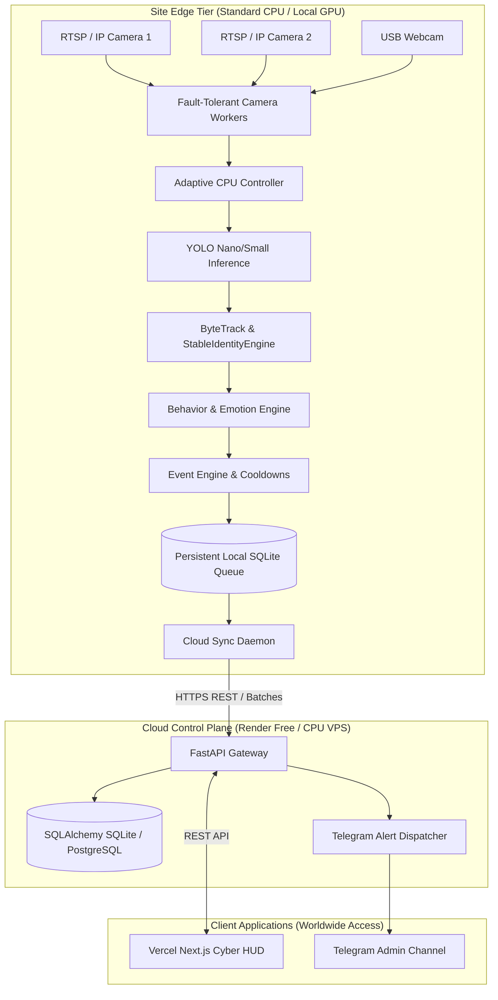

# OMS Sentinel — Production Architecture Reference

## Executive Summary
**OMS (Object Monitoring System)** is an autonomous AI surveillance platform designed with a **CPU-First Edge + Lightweight Cloud Control Plane** architecture. 

It eliminates the requirement for expensive 24/7 cloud GPUs by executing all computer vision inference, object tracking, and behavior analysis directly on local edge hardware (standard multi-core CPUs or local NVIDIA GPUs). Only structured events, telemetry heartbeats, and alert metadata are transmitted to the cloud.

---

## 1. System Architecture

---

## 2. Edge vs. Cloud Responsibility Matrix

| Capability | Edge Agent (`edge/`) | Cloud Hub (`cloud/`) |
| :--- | :---: | :---: |
| **Continuous Video Decoding** | ✅ 25–30 FPS | ❌ (Zero Raw Video Processing) |
| **YOLO Object Detection & Tracking** | ✅ (CPU / CUDA Auto) | ❌ |
| **YuNet / SFace Face Recognition** | ✅ (Local Inference) | ❌ |
| **Behavior & Anomaly Analysis** | ✅ (Local Heuristics) | ❌ |
| **Offline Resilience & Event Buffering** | ✅ (Persistent SQLite Queue) | ❌ |
| **Worldwide Dashboard Hosting** | ❌ | ✅ (Vercel + FastAPI) |
| **Persistent Incident Database** | ❌ (Queue Only) | ✅ (PostgreSQL / SQLite) |
| **Telegram & Webhook Notifications** | ❌ (Delegated) | ✅ (Centralized Router) |
| **Hardware Required** | Normal CPU (or GPU) | **512 MB RAM / 0.1 vCPU** |

---

## 3. CPU-First AI Optimizations

1. **Adaptive Controller (`edge/health/monitor.py`)**:
   - Continuously measures CPU load using `psutil`.
   - Automatically downscales detection resolution (`640x384` ➔ `480x288` ➔ `320x192`) if CPU load exceeds 85%.
   - Increases frame-skip interval (`process_every_n`) during load spikes to prevent frame lag.

2. **Frame Skipping with Tracker Interpolation**:
   - Camera captures at full 25–30 FPS.
   - YOLO inference runs at 3–8 FPS.
   - ByteTrack tracker smoothly interpolates bounding boxes between detection cycles.

3. **Event Cooldowns & Deduplication (`edge/events/engine.py`)**:
   - Applies per-event cooldowns (e.g. 3 minutes for loitering, 45 seconds for person presence).
   - Deduplicates identical events using MD5 payload hashes.
